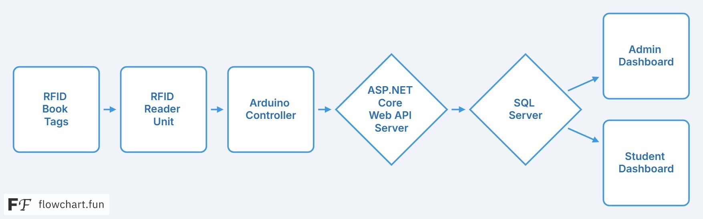

# 📚 TagMyBook – RFID-Based Library Checkout System

**TagMyBook** is a full-stack smart library automation system using **RFID technology**, **Arduino**, and **ASP.NET Core Web API** with **SQL Server** as the backend. Built to eliminate manual errors in book check-in/check-out, it offers a modern user experience with dashboards for both students and admins.

---

## 🚀 Features

- 📖 RFID-based Book Checkout and Return
- 👨‍🎓 Student and 👩‍💼 Admin Dashboards
- 🔍 Live Book Search with Category Filters
- 📅 Return Due Date Calendar
- 📦 Option to Buy PDF/Hard Copy
- 🌗 Dark Mode Toggle
- 📲 QR Code Generation for Books
- 🧩 Secure Login & Register with Google/GitHub OAuth

---

## 🛠️ Tech Stack

| Layer        | Technology                          |
|--------------|-------------------------------------|
| Hardware     | Arduino UNO, RFID RC522             |
| Backend      | ASP.NET Core Web API                |
| Database     | Microsoft SQL Server                |
| Frontend     | HTML, CSS, Bootstrap, JavaScript    |
| Tools Used   | Postman, GitHub, Figma, VS Code     |

---

## 📐 System Architecture

 <!-- replace with actual image link from GitHub or Imgur -->

---

## 📸 UI Screenshots

| Welcome Page | Register Page | Login Page |
|--------------|---------------|-------------|
|  |  |  |

| Student Dashboard | Book List View | Admin Dashboard |
|-------------------|----------------|------------------|
|  |  | *Coming Soon* |

---

## 🔧 How to Run Locally

```bash
# Backend
1. Open the solution in Visual Studio
2. Run the ASP.NET Core Web API project
3. Connect to local SQL Server (or modify connection string)

# Frontend
1. Open the HTML folder in VS Code
2. Launch using Live Server or any local server
