# 📚 TagMyBook – RFID-Based Library Checkout System

**TagMyBook** is a full-stack smart library automation system using **RFID technology**, **Arduino**, and **ASP.NET Core Web API** with **SQL Server** as the backend. Built to eliminate manual errors in book check-in/check-out, it offers a modern user experience with dashboards for both students and admins.

---

## 🚀 Features

- 📖 RFID-based Book Checkout and Return
- 👨‍🎓 Student and 👩‍💼 Admin Dashboards
- 🔍 Live Book Search with Category Filters
- 📅 Return Due Date Calendar
- 📦 Option to Buy PDF/Hard Copy
- 🌗 Dark Mode Toggle
- 📲 QR Code Generation for Books
- 🧩 Secure Login & Register with Google/GitHub OAuth

---

## 🛠️ Tech Stack

| Layer        | Technology                          |
|--------------|-------------------------------------|
| Hardware     | Arduino UNO, RFID RC522             |
| Backend      | ASP.NET Core Web API                |
| Database     | Microsoft SQL Server                |
| Frontend     | HTML, CSS, Bootstrap, JavaScript    |
| Tools Used   | Postman, GitHub, Figma, VS Code     |

---

## 📐 System Architecture

 <!-- replace with actual image link from GitHub or Imgur -->

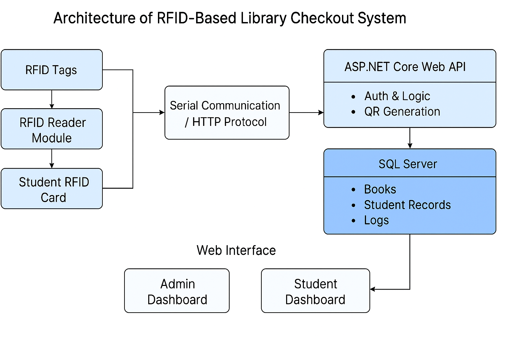

## 📸 UI Screenshots

| Welcome Page |
|--------------|---------------|-------------|
| 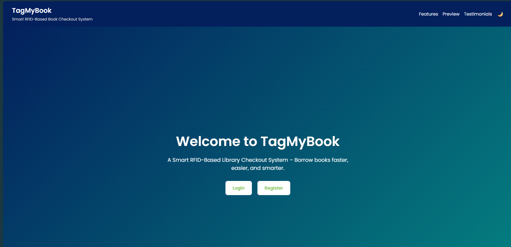 |

 | Register Page |
| 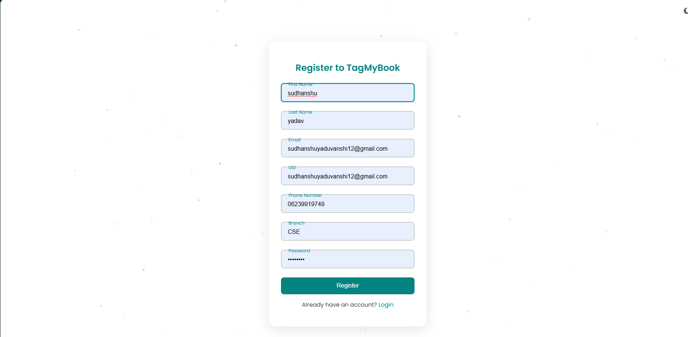 |

| Login Page |
| 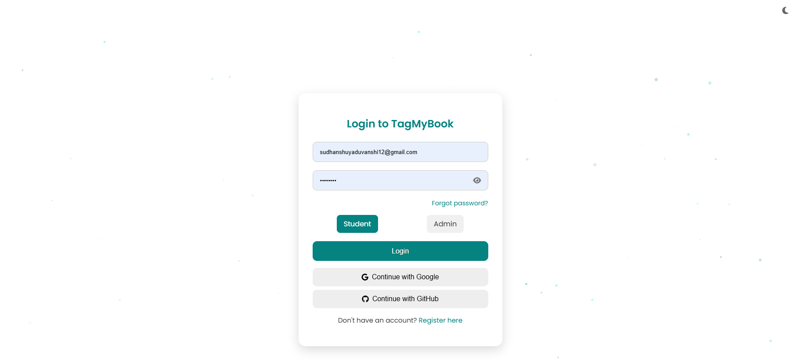 |

| Student Dashboard | 
|-------------------|----------------|------------------|
| 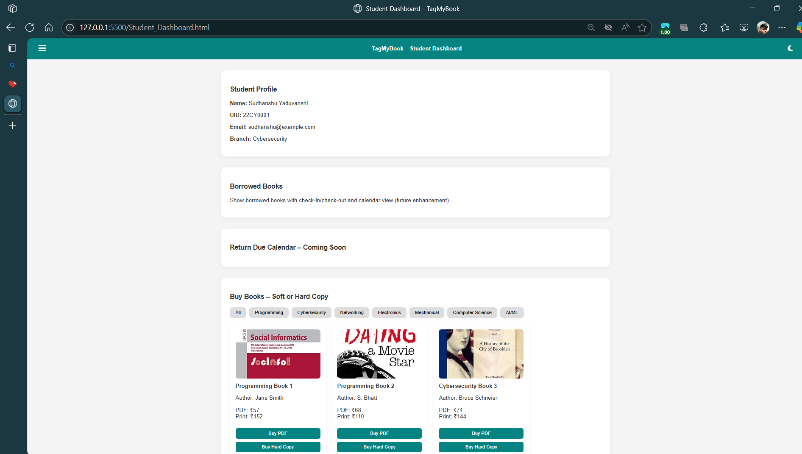 |

| Book List View | 

| 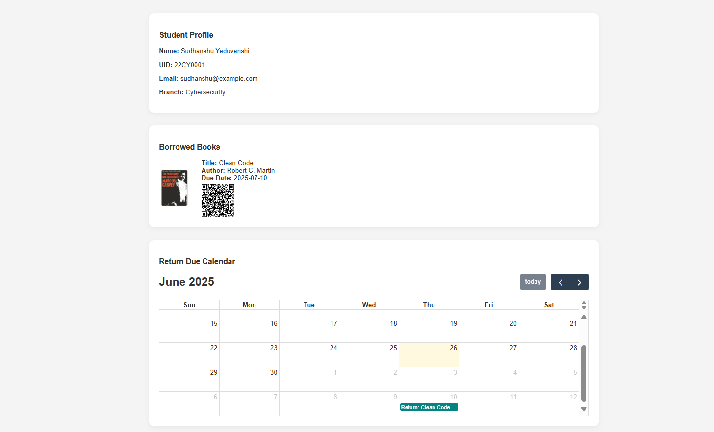 

| Admin Dashboard |
|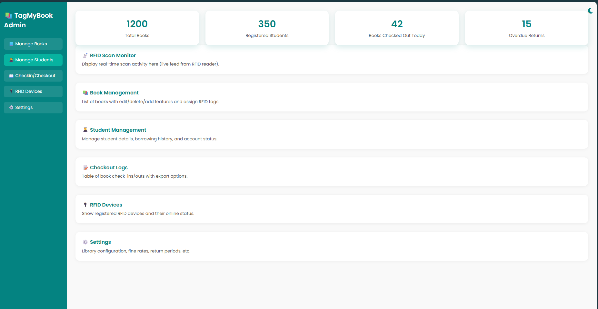|
| Admin Manage Book |
|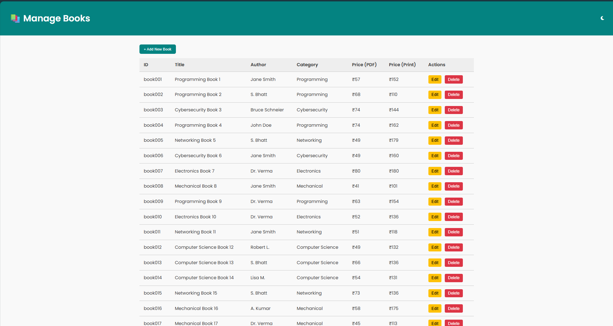|
| Admin RFID Manager |
|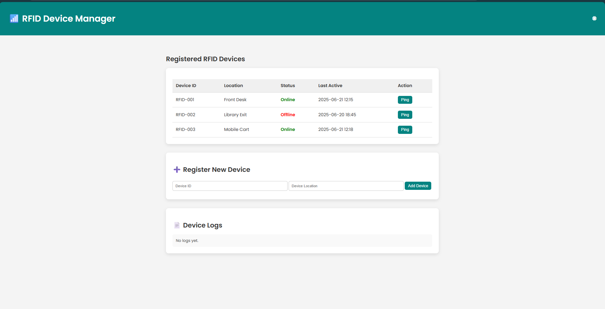|
| Admin Setting |
|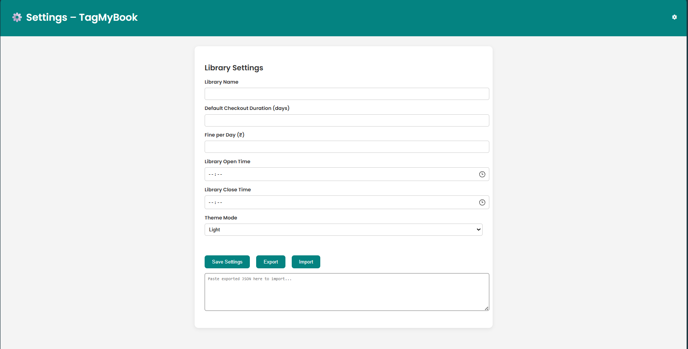|
| Admin CheckOut CheckIn Page |
|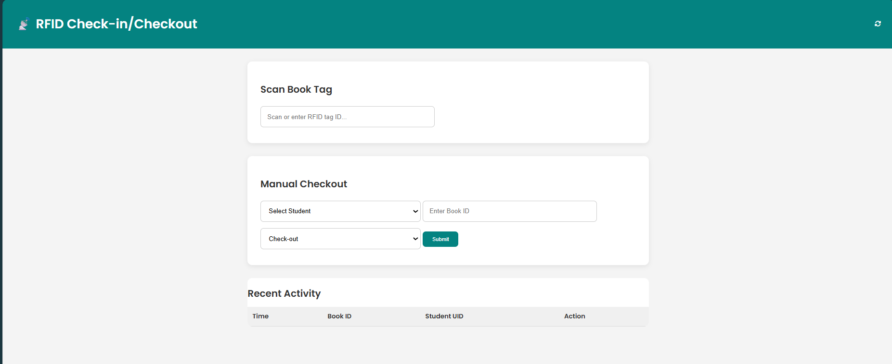|
---

## 🧪 How to Run Locally

### 🔹 Backend (ASP.NET Core)

1. Open the `.sln` solution file in **Visual Studio**
2. Restore NuGet packages
3. Update the connection string in `appsettings.json`
4. Run the project — Swagger UI should open
5. Use **Postman** to test APIs (optional)

### 🔹 Frontend (HTML/CSS/JS)

1. Open the `frontend/` folder in **VS Code**
2. Right-click `index.html` and choose **“Open with Live Server”**
3. Browse the Student or Admin dashboard pages

## 🧾 Project Overview

This project digitizes and automates the book issue/return process in academic libraries using RFID technology. It features two distinct dashboards — one for students to search and borrow books, and one for admins to manage the library, inventory, and user activity.
